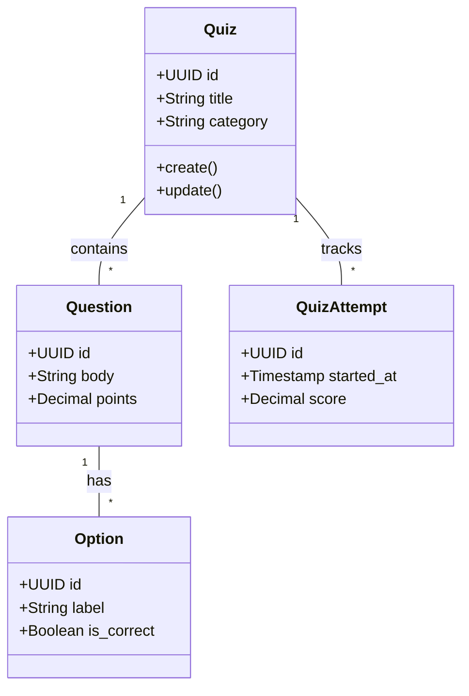
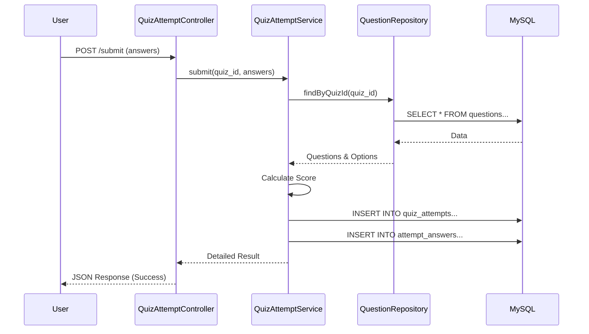

# Design & Architecture - Qwizzy

## 1. Architecture Overview
Qwizzy follows a **Layered Architecture** (often called Controller-Service-Repository pattern).

- **Controllers**: Handle API requests, validation, and sending responses.
- **Services**: Contain the core business logic (e.g., scoring, authentication).
- **Repositories**: Direct interface with the database (SQL queries).
- **Validators**: Joi schemas for input validation.

## 2. UML Diagrams

### 2.1 Use Case Diagram
```mermaid
useCaseDiagram
    actor Instructor
    actor User
    
    package Qwizzy {
        usecase "Create Quiz" as UC1
        usecase "Manage Questions" as UC2
        usecase "Take Quiz" as UC3
        usecase "View Results" as UC4
        usecase "Auth (Login/Signup)" as UC5
    }
    
    Instructor --> UC1
    Instructor --> UC2
    Instructor --> UC4
    Instructor --> UC5
    
    User --> UC3
    User --> UC4
    User --> UC5
```

### 2.2 Class Diagram (System Structure)


### 2.3 Sequence Diagram (Quiz Submission)


## 3. Design Patterns Used

### 3.1 Repository Pattern
Decouples business logic from the data access layer. Every table has a corresponding repository (e.g., `UserRepository`, `QuizRepository`).

### 3.2 Singleton Pattern
The database connection pool (`db.js`) is initialized once and reused across the application to manage resources efficiently.

### 3.3 Factory Pattern (Proposed Implementation)
Used to instantiate different types of questions (MCQ vs True/False) logic.

### 3.4 Strategy Pattern (Proposed Implementation)
Used for different scoring methods (e.g., standard grading vs weighted grading).
